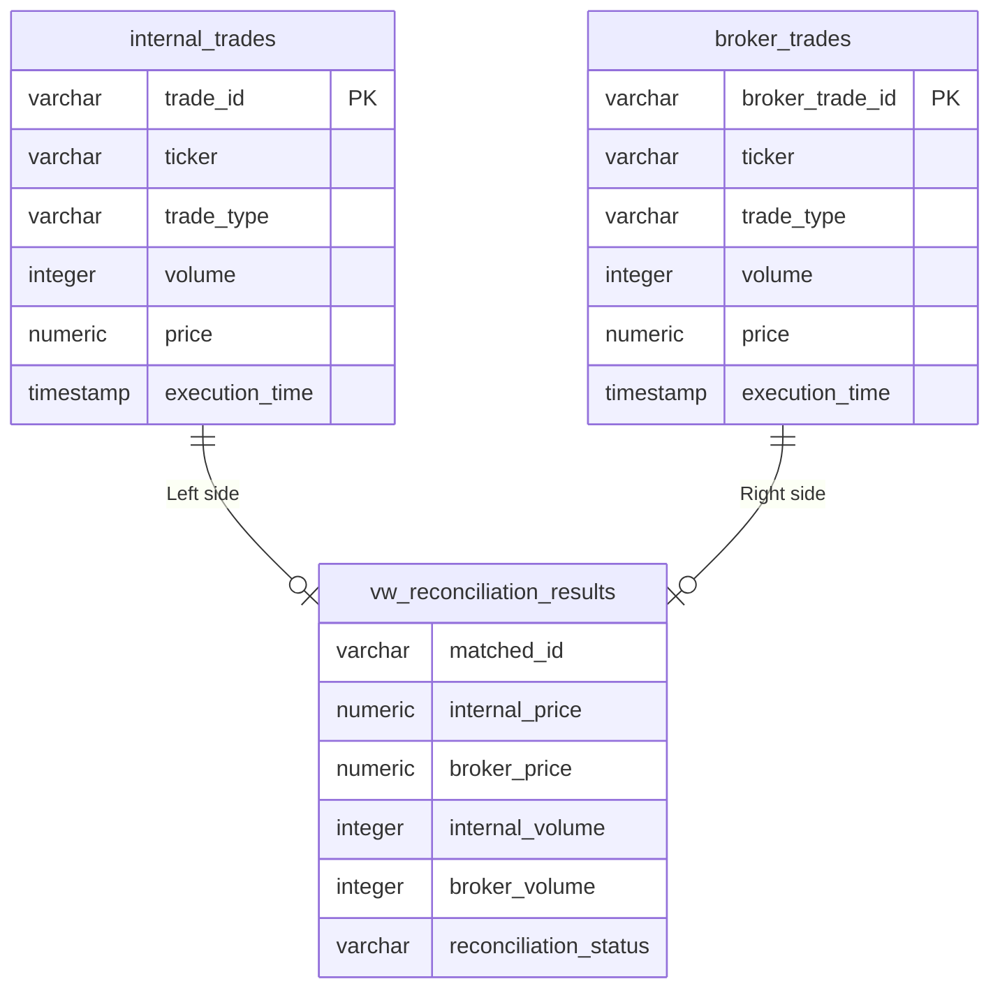

# Financial Trade Reconciliation Engine

A full-stack OLAP system that ingests trade data from two financial ledgers,
detects discrepancies in real time, and surfaces only the anomalies that
matter — built with Next.js, PostgreSQL (Supabase), and Python.

---

## The Problem

Every financial institution that trades maintains two sets of records.

An internal ledger logging every executed order. A broker log from the
execution venue recording the same trades from their side. These two books
should match perfectly. Due to network latency, message queue delays, and
high-frequency volumes, they frequently don't.

A single orphaned trade, a shifted decimal point, or a volume recorded as
500 on one side and 498 on the other — individually small, collectively
expensive. Undetected discrepancies compound into unhedged exposures,
regulatory violations, and accounting failures that operations teams catch
only at end-of-day, hours after the damage has accumulated.

This system replaces end-of-day spreadsheet audits with real-time automated
detection.

---

## Architecture Decisions

### Why server-side SQL filtering — not client-side JavaScript

The dashboard has a threshold slider. Every time it moves, a filtering
decision happens.

The naive approach: download all records to the browser, filter in
JavaScript. This works at 100 rows. At 10,000 rows of financial trade data,
it creates memory saturation, security exposure (raw financial records in
the browser), and a performance ceiling that doesn't scale.

The decision: every slider movement sends a single parameter to a Next.js
server action. PostgreSQL runs the ABS() delta calculations across all
records internally using its own execution engine. Only the anomalies
exceeding the threshold travel back over the network.

The browser receives a tiny, already-filtered payload and renders it.
Sub-second response across 1,000+ records. The same architecture holds at
10 million rows — the browser was never doing the work.

### Why raw source tables are never modified

Both ledgers are stored exactly as received. Nothing normalised at
ingestion. Nothing cleaned before storage.

The reconciliation view sits on top and handles all classification — field
name differences, format inconsistencies, COALESCE logic pairing records
across both sources. Every transformation happens in the view definition,
not in the stored data.

In financial systems, the original record is the audit trail. Regulators
ask for it. Compliance requires it. Cleaning at ingestion means the
original is gone. Cleaning in views means the original is always there.

### The floating-point decision

During testing, trades with identical prices were being flagged as
mismatches. Internal price: 142.30. Broker price: 142.30. Status: Price
Mismatch.

The issue: SQL stores decimal numbers as binary approximations. Two values
that appear identical on screen can differ by 0.000000000001 at the binary
level. Strict equality comparison flagged these as errors.

The fix: threshold-based comparison — flag a price mismatch only when
ABS(internal_price - broker_price) exceeds 0.01. But the more important
outcome: this technical decision revealed a business question. What is the
right tolerance? Is 0.01 too generous for derivatives? Too strict for FX?
Who decides — the engineer or the compliance team?

The system exposes threshold controls to operations users precisely because
this is a business judgment, not a technical constant.

---

## Data Pipeline

Synthetic trade records generated using Python's Faker library with
intentional corruptions seeded to mirror real financial system failure
modes:

- 5% price discrepancies — single-cent differences typical of floating-
  point rounding across different systems
- 5% orphaned drops — trades present in one ledger, absent from the other
- Volume mismatches — same trade ID and price, different quantity recorded
  on each side

The corruption rate and failure types are based on published reconciliation
failure patterns in financial operations literature, not arbitrary.

---

## Schema



---

## Setup

### 1. Database (Supabase)
- Create a new Supabase project
- Execute table creation schemas for `internal_trades` and `broker_trades`
- Deploy the `get_dynamic_reconciliations` stored procedure
  (see `fix_rpc_function.sql`)

### 2. Data Pipeline (Python)
```bash
pip install pandas faker
python generate_data.py
```
Upload generated CSV outputs to your Supabase instance.

### 3. Dashboard (Next.js)
```bash
cd dashboard
npm install
```
Create `.env.local`:
```env
NEXT_PUBLIC_SUPABASE_URL=your_project_url
NEXT_PUBLIC_SUPABASE_ANON_KEY=your_anon_key
```
```bash
npm run dev
```

---

## What this taught me

The hardest part of building analytical systems is not the SQL.

It is deciding what counts as an anomaly before writing a single query.
Two records can differ by ₹0.01 because of floating-point precision, because
one system rounds differently, because a transaction arrived 48 milliseconds
late. Each of these is a different problem requiring a different business
rule.

The best technical solution here was not better code. It was understanding
the rules of the business well enough to encode them correctly — and
exposing the decisions that belong to operations teams rather than burying
them in hardcoded constants.

That is the intersection this project lives at: data engineering, product
thinking, and business logic in the same conversation.
