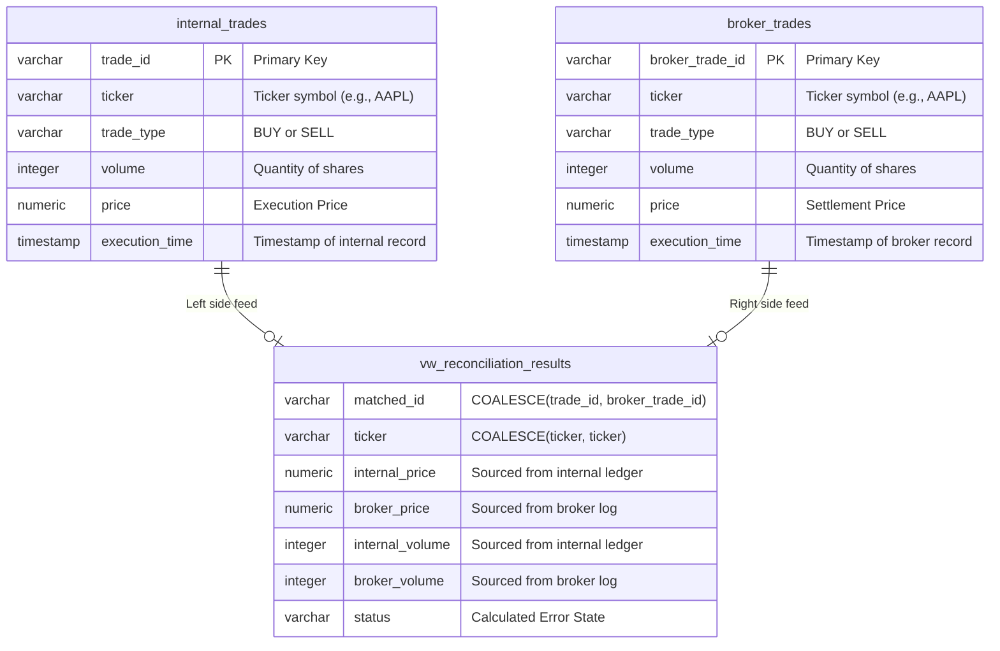

# Financial Trade Reconciliation Engine

An enterprise-grade, full-stack Online Analytical Processing (OLAP) engine designed to ingest, compare, and isolate anomalies across high-frequency financial transaction ledgers in real-time.

Built with Next.js, PostgreSQL (Supabase), and Python, this system demonstrates advanced database engineering patterns, relational algebra, and scalable system architecture optimized for capital markets and quantitative financial operations.

---

## Executive Summary & Business Problem

In institutional finance, buy-side firms maintain an **Internal Ledger** recording executed orders, while sell-side execution venues (brokers, clearinghouses) maintain their own **Broker Logs**. Due to high-frequency trading volumes, message queue latency, network dropouts, and race conditions, these two data streams frequently drift. 

Common discrepancies include:
* **Orphaned Trades:** Transactions that exist in one ledger but are completely absent from the other.
* **Typographical/Transmission Errors:** Execution price shifts (e.g., shifted decimals) or volume mismatches.

Even minor errors can result in multi-million dollar unhedged exposures, regulatory compliance violations, and severe accounting reconciliation errors. 

Rather than relying on rigid, resource-intensive, end-of-day batch processing or spreadsheet audits, this system provides a **real-time, automated reconciliation engine** powered by dynamic, server-side relational comparison to detect and isolate trade mismatches instantly.

---

## Architecture & Engineering Design Decisions

### Data Layer: Database-Side Computations (Supabase / PostgreSQL)
To prevent network bottlenecks and client-side memory saturation (which typically occur when downloading millions of trade rows to the browser), this engine shifts the computational load directly onto the PostgreSQL engine:

* **Dynamic Database RPCs:** Discrepancy checks are managed via a custom PostgreSQL Stored Procedure (`get_dynamic_reconciliations`). This function dynamically accepts tolerance thresholds (e.g., maximum allowable price and volume variance) straight from the frontend UI.
* **On-the-Fly FULL OUTER JOINs:** The stored procedure executes a comprehensive `FULL OUTER JOIN` between both ledgers, utilizing database-level `ABS()` calculations and `COALESCE()` matching to evaluate records.
* **Data Minimization:** Only matching failures and anomalies that exceed the designated user tolerances are returned over the wire. This optimizes network bandwidth, minimizes latency, and prevents security vulnerabilities related to data over-fetching.

### Presentation Layer: Responsive Command Center (Next.js & Tailwind CSS)
* **Debounced Event Handlers:** Inputs and sliders in the dashboard interface are debounced by 300ms. This prevents high-frequency query flooding to the database while users slide tolerance inputs.
* **Decoupled State Management:** Dashboard UI presentation states are isolated from raw database query streams, ensuring the page remains responsive under heavy workloads.

---

## Database Schema & Relations

The data reconciliation model relies on a `FULL OUTER JOIN` to properly align both sets of transactions, identifying unmatched transactions on either side.



---

## Setup & Local Installation

### 1. Database Setup (Supabase)
1. Initialize a new project in the Supabase Dashboard.
2. Execute the table creation schemas for `internal_trades` and `broker_trades`.
3. Deploy the dynamic Remote Procedure Call (RPC) functions and views. (See the SQL scripts in `fix_rpc_function.sql` for the complete function definition of `get_dynamic_reconciliations` utilizing `SECURITY DEFINER` for secure access control and correct type casting).

### 2. Data Pipeline Configuration (Python)
The data generator populates the database tables with synthetic ledger entries, intentionally seeding them with anomalous records (e.g., price differences, orphaned trades, volume mismatches).

Navigate to the data-pipeline directory and run:
```bash
pip install pandas faker
python generate_data.py
```
Export and upload the resulting CSV outputs into your Supabase database instance.

### 3. Dashboard Web Application (Next.js)
1. Clone the repository and install the NPM packages:
   ```bash
   cd dashboard
   npm install
   ```
2. Create a `.env.local` configuration file in the `dashboard` root directory:
   ```env
   NEXT_PUBLIC_SUPABASE_URL=your_project_url_here
   NEXT_PUBLIC_SUPABASE_ANON_KEY=your_anon_key_here
   ```
3. Start the local Next.js development server:
   ```bash
   npm run dev
   ```

---

## Key Learnings & Engineering Principles

* **Data Quality Engineering:** Designed and implemented mechanisms to catch and isolate silent data corruption, transmission delays, and human entry errors.
* **High-Performance SQL Dialect:** Utilized advanced relational algebra, structural indexes, and database-level optimization techniques (such as stored procedures and custom views) to move heavy computational logic closer to the physical storage layer.
* **Security & Access Control:** Followed best practices for Row-Level Security (RLS) and database function permissions (`SECURITY DEFINER`) to prevent unauthorized data access or exposure.